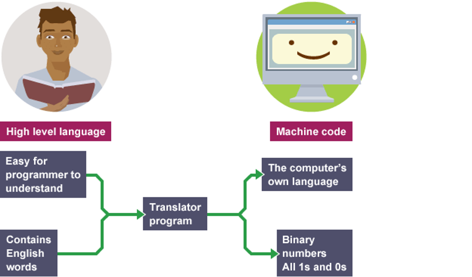
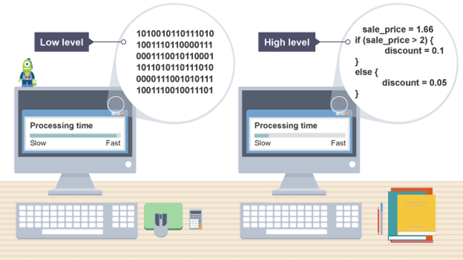
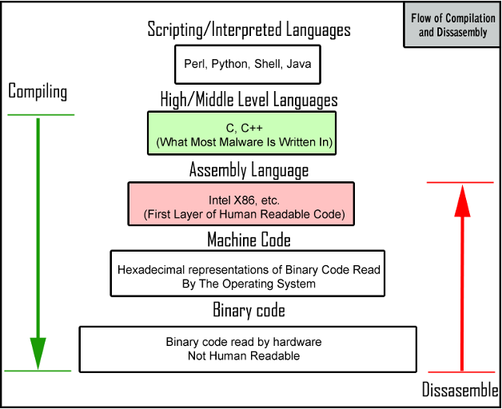
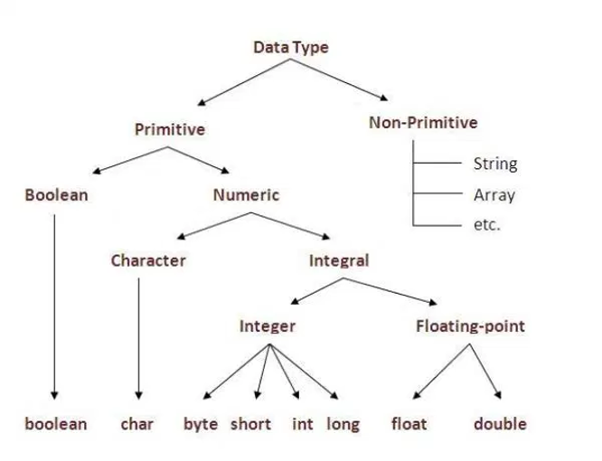
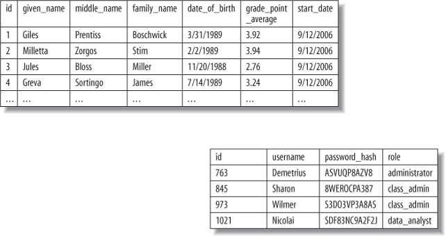
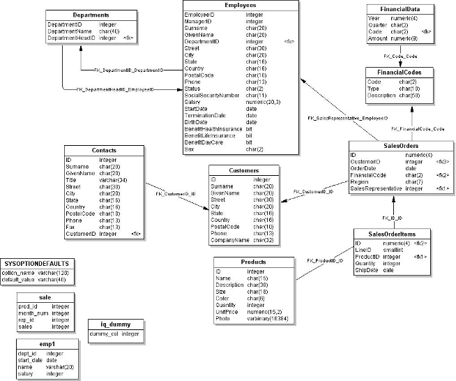
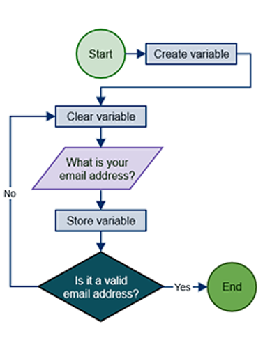
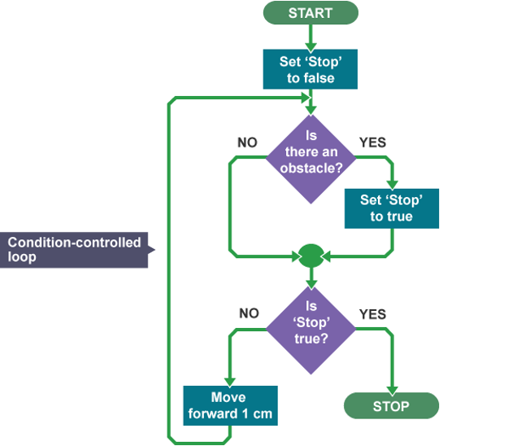

<!--- 
mkdir -p .qmd-pause && mv *.qmd .qmd-pause/ && \
  quarto add r-wasm/quarto-live; \
  mv .qmd-pause/* . && rmdir .qmd-pause
----->



## Dagens program

1. **Skal vi stadig kode?** (...om AI og kode)

2. **Systemet er/som lag** (Kernighan kapitel 6)

3. **Workshop** (I får en bestilling på et "IT system" fra mig)

4. **At designe en funktion** (Downey kapitel 4, 5 og 6)

5. **Paradigmer** (... den samme opgave løst på tre måder)

6. **Workshop øvelse** 

<br>

I skriver ikke færdig kode i dag. I skriver **grænseflader**, altså hvad hver funktion skal hedder, hvad den får ind, og hvad den giver tilbage.

## Litteraturen til idag, og hvor den bruges

| Kapitel | Bruges til |
|---|---|
| **Downey kp. 4:** *Functions and Interfaces* | Grænseflade mod implementation, docstrings, præ- og postbetingelser, udviklingsplanen |
| **Downey kp. 5:** *Conditionals and Recursion* | Booleske udtryk, kædede betingelser, rekursion og base case |
| **Downey kp. 6:** *Return Values* | `return` mod `print`, rene funktioner, inkrementel udvikling, validering af input |
| **Kernighan kp. 6:** *Software Systems* | Systemer som lag, styresystem, filsystem, grænseflader |
| **Kernighan kp. 7:** *Learning to Program* | Hvorfor man skal kunne læse kode, også når man ikke skriver den selv |

<br>

# Skal vi stadig kode?

## {background-image="resources/jensen.png" background-size="contain"}

---

Forestil jer, at vi har bygget et system med `prompts`. Vi har forbedret det lidt ad gangen, prompt for prompt, indtil det virkede.

```
> lav et system der ...
> tilføj X ...
> tilføj y ...
> osv ...
```

Det kører. Vi bruger det i et par år. Så opstår der et nyt behov.

::: {.incremental}

- Kan vi vende tilbage til koden og tilføje det, uden at kunne kode?

- Kan vi overhovedet genskabe systemet 1:1 ... selv hvis vi i et øjeblik af klarsyn gemte alle vores prompts?

:::

<br>

::: {.fragment}
*Min personlige og* **for nuværende** *erfaring siger nej. Men hvad tænker I?*
:::

## De blinde leder de blinde

> Jeg ville ikke oversætte en tekst til kinesisk (med AI) og derefter helt ukritisk sende den til udgivelse i Kina.

<br>

#### Et læringsperspektiv

*Tænk på, hvad Words stavekontrol har gjort for skrivefærdigheder.*

<br>

::: {.fragment}
Det er ikke et argument mod at bruge værktøjet. Det er også Kernighans argument (kp 7): man skal kunne læse kode(n)—også den, man ikke selv har skrevet, hvis man skal arbejde "med IT".
:::

# Systemet er lag

## Software er lag

Kernighan (kp 6): det, vi kalder "en computer", er lag af software oven på hinanden. Hvert lag bruger det nedenunder uden at vide, hvordan det virker indeni.

- **Styresystemet**: deler processoren, hukommelsen og disken ud mellem programmerne

- **Filsystemet**: får en disk med nummererede blokke til at ligne mapper og filer

- **Applikationerne**: browseren, VS Code, "programmer"

<br>

::: {.fragment}
Det lyder abstrakt, men da I skrev `ls` i lektion 1, spurgte I ikke disken. I spurgte et lag, der spurgte et lag, der spurgte disken.
:::

## `ls`

::: {.incremental}

1. **Terminalen** er et vindue, der kan vise tekst. Den kan ikke læse en disk. Den giver linjen videre til **skallen/shell** (`zsh` på Mac, PowerShell på Windows.)

2. Skallen finder programmet `ls` og beder styresystemet om at starte det.

3. `ls` spørger styresystemet: *giv mig indholdet af den her mappe.* Det kaldes et **systemkald**. `ls` rører aldrig disken selv: det har den **ikke lov til**.

4. Styresystemet tjekker først, om I må læse mappen. Så spørger det **filsystemet** som ved, at mappen står i blok 4711.

5. **Driveren** oversætter *giv mig blok 4711* til det, netop denne disk forstår.

6. **SSD'ens egen controller** ved, hvilke fysiske celler blok 4711 ligger i *lige nu*. 

:::

---

Svaret kommer tilbage gennem de samme fem lag. `ls` sorterer navnene og skriver dem ud. Terminalen tegner dem som pixels.

<br>

- Det er altså fem lag og et systemkald for at se, hvad der ligger i en mappe.

- ... `ls` ved stadig ikke, om jeres computer har en SSD, en gammel harddisk eller et netværksdrev. Det er ikke nødvendigt. 


## Hvorfor det er bygget sådan


... det er præcis det, I skal gøre om lidt i det små. Vi skriver `andel()` sådan, at den, der bruger den, ikke behøver vide, hvordan den regner.


## Abstraktion



---



---



## Grænsefladen mellem lagene

Et lag kan skiftes ud, uden at de andre opdager det: så længe **grænsefladen** er den samme. Det er derfor, en SSD kan erstatte en harddisk, uden at jeres tekstbehandling skal skrives om.

<br>

- Downey kalder det samme for en **interface**, bare inde i ét program: *hvordan* en funktion bruges, adskilt fra *hvordan* den virker.

- Det er dagens opgave. I skal lægge grænsefladerne fast i barometeret, før nogen skriver en eneste linje, der regner på noget.

## Open source

Kernighan bruger open source som eksempel på, hvad der sker, når koden er åben. Andre kan læse den, finde fejl i den og bygge videre på den.

<br>

I gjorde præcis det sidste gang. I forkede mit repository, ændrede i kopien og sendte ændringen tilbage. Det er sådan, meget udvikling af software foregår.

## Det samme princip gælder inde i en Python-funktion

Python funktioner som et *interface*.

- Forestil jer en funktion, der beregner gennemsnittet af en liste med tal. Dens grænseflade fortæller os, hvordan vi kalder funktionen, hvilke argumenter den forventer, og hvad den returnerer.

- Vi behøver ikke kende den interne kode for at bruge den. Og hvis vi ændrer den interne beregning, kan resten af programmet fortsat fungere, så længe grænsefladen og funktionens forventede adfærd bevares.

::: {.fragment}
**Det er dagens opgave:** I skal aftale grænsefladerne i jeres barometer. Hvilke oplysninger modtager hvert lag? Hvad skal det levere videre? Og hvad skal laget gøre?

Først derefter (senere på kurset) skriver I koden, der udfører beregningerne.
:::


# Computationel tænkning

## Fire greb

::: {.incremental}

- **Dekomposition**: del det store problem op i dele, der kan bygges hver for sig

- **Mønstergenkendelse**: find det, der ligner noget, I har set før

- **Abstraktion**: smid alt det væk, der ikke betyder noget for opgaven

- **Algoritmedesign**: skriv fremgangsmåden ned, trin for trin, uden huller

:::

<br>

::: {.fragment}
De fire greb er ikke programmering. De er det, man gør **inden**.
:::

## Data



## Lagring af data



---



## Algoritmer



---



# Workshop: En bestilling fra en kunde

## Bestillingen

> "Jeg har skrevet en rapport om diversitet på danske arbejdspladser. Nu vil jeg gerne have sådan et **online barometer**, hvor en virksomhed kan taste sine egne tal ind og se, hvordan de ligger i forhold til andre. Det skal også kunne bruges til at slå ting op. Kan I ikke bygge det?"

<br>

Det er alt, I får. Det skal ligne en (stiliseret) virkelig bestilling fra en ikke-IT-kyndig kunde ... 

**Hvad er der galt med den?** Ikke noget ... bortset fra at man ikke kan bygge efter den.

## Øvelse 1: Krav/specifikation-interviewet

<span class="timer" data-time="600"></span>

**Første arbejde i gruppen.** Skriv de spørgsmål ned, I vil stille. Prioritér dem, som om I ikke får tid til dem alle.

- Hvad skal brugeren kunne **gøre bagefter**, som de ikke kan i dag?

- Hvem er brugeren egentlig? Er der mere end én slags?

- Hvad skal systemet **ikke** kunne?

<br>

**Derefter "interviewer" vi i plenum.** 

# At designe en funktion

## Grænseflade og implementation

Downey deler en funktions design i to:

::: {.incremental}

- **Grænsefladen**: hvad funktionen hedder, hvilke parametre den tager, og hvad den skal gøre

- **Implementationen**: hvordan den gør det

:::

<br>

::: {.fragment}
To funktioner kan have den **samme grænseflade** og helt forskellige implementationer. Det er hele pointen: så kan man skifte det indeni ud uden at røre resten af programmet.
:::

::: {.fragment}
I dag designer I grænseflader. Implementationen kommer senere og må gerne blive skiftet ud undervejs.
:::

## Docstring: grænsefladen skrevet ned

::: {.kode-split}

```{pyodide}
#| autorun: false
def andel(antal, i_alt):
    """Beregn en andel af de ansatte.

    antal: heltal, 0 eller derover, ikke større end i_alt
    i_alt: heltal større end 0
    returnerer: et tal mellem 0 og 1
    """
    return antal / i_alt

print(andel(84, 120))
help(andel)
```

:::

::: {.aside}
En docstring forklarer **hvad**, ikke hvordan. Fra Downey: har man svært ved at forklare en funktion kort, er grænsefladen sandsynligvis forkert.
:::

## Præ- og postbetingelser

En grænseflade er en **kontrakt**. Den, der kalder, lover noget om argumenterne (**præbetingelser**). Funktionen lover noget om resultatet (**postbetingelser**).

::: {.kode-split}

```{pyodide}
#| autorun: false
def andel(antal, i_alt):
    """Beregn en andel. Returnerer None, hvis tallene ikke giver mening."""
    if not isinstance(antal, int) or not isinstance(i_alt, int):
        print("andel er kun defineret for heltal.")
        return None
    if i_alt <= 0:
        print("Der skal være mindst én ansat.")
        return None
    if antal > i_alt:
        print("Der kan ikke være flere i gruppen end der er ansatte.")
        return None
    return antal / i_alt

print(andel(84, 120))
print(andel(130, 120))
print(andel(84, 0))
```

:::

::: {.aside}
Downey kalder det **input validation**. Bryder den, der kalder, en præbetingelse, ligger fejlen hos kalderen, ikke i funktionen. Det er værd at vide, når man leder efter en fejl.
:::

# Returværdier

## `print` eller `return`?

::: {.kode-split}

```{pyodide}
#| autorun: false
def vis_andel(antal, i_alt):
    print(antal / i_alt)

def beregn_andel(antal, i_alt):
    return antal / i_alt

a = vis_andel(84, 120)
print("vis_andel gav:", a)

b = beregn_andel(84, 120)
print("beregn_andel gav:", b)
print("og den kan regnes videre på:", round(b * 100), "procent")
```

:::

::: {.fragment}
En funktion uden `return` giver `None`. Den kan vise noget på skærmen, men resultatet kan ikke bruges videre. En funktion, der kun returnerer, kaldes en **ren funktion**.
:::

## Booleske funktioner

En funktion må gerne returnere `True` eller `False`. Det er en god måde at pakke en indviklet test ind under et navn, man kan læse.

::: {.kode-split}

```{pyodide}
#| autorun: false
def er_stor_nok(ansatte):
    """Er arbejdspladsen med i rapportens grundlag?"""
    return ansatte >= 50

print(er_stor_nok(120))
print(er_stor_nok(12))

if er_stor_nok(120):
    print("Med i barometeret")
```

:::

::: {.aside}
Skriv `if er_stor_nok(120):` — ikke `if er_stor_nok(120) == True:`. Sammenligningen er overflødig, for udtrykket **er** allerede sandt eller falsk.
:::

## Inkrementel udvikling (1)

Tilføj og test lidt kode ad gangen. Start med en funktion, der er færdig — men ikke gør noget endnu.

::: {.kode-split}

```{pyodide}
#| autorun: false
def placering(andel, percentiler):
    """Hvor ligger andelen i fordelingen? Foreløbig: ingen steder."""
    return "ukendt"

percentiler = {"p25": 0.30, "p50": 0.45, "p75": 0.60}
print(placering(0.42, percentiler))
```

:::

::: {.fragment}
Den gør ingenting — men den **kan kaldes**, og den returnerer noget. Nu kan resten bygges op omkring den, mens den stadig er tom.
:::

## Inkrementel udvikling (2)

::: {.kode-split}

```{pyodide}
#| autorun: false
def placering(andel, percentiler):
    """Hvor ligger andelen i fordelingen?

    andel: tal mellem 0 og 1
    percentiler: dictionary med nøglerne p25, p50 og p75
    returnerer: "lav", "middel" eller "hoej"
    """
    if andel < percentiler["p25"]:
        return "lav"
    elif andel < percentiler["p75"]:
        return "middel"
    else:
        return "hoej"

for tal in [0.20, 0.42, 0.75]:
    print(tal, "->", placering(tal, percentiler))
```

:::

::: {.aside}
Undervejs havde funktionen `print`-linjer, der viste mellemregningerne. Downey kalder dem **stilladser**: de hjælper, mens man bygger, og fjernes, når det står.
:::

## Kædet eller indlejret?

:::: {.columns}
::: {.column width="50%"}
**Kædet**: med `elif`

```python
if andel < p25:
    return "lav"
elif andel < p75:
    return "middel"
else:
    return "høj"
```
:::

::: {.column width="50%"}
**Indlejret**: `if` inden i `if`

```python
if andel < p25:
    return "lav"
else:
    if andel < p75:
        return "middel"
    else:
        return "høj"
```
:::
::::

<br>

De gør det samme. Den venstre er nemmere at læse og rækkefølgen betyder noget: kun den **første** sande gren kører.

# Paradigmer

## Sproget vælger ikke for jer

Et **paradigme** er en måde at organisere kode på. De fleste sprog kan flere.

| Sprog | Paradigmer |
|---|---|
| **Python** | Objektorienteret, procedureorienteret, funktionsorienteret |
| **R** | Funktionsorienteret, procedureorienteret |
| **C** | Procedureorienteret, imperativ |
| **Java** | Objektorienteret, imperativ |
| **JavaScript** | Hændelsesdrevet, funktionsorienteret, objektorienteret |
| **Haskell** | Funktionsorienteret, deklarativ |
| **Prolog** | Logikbaseret, deklarativ |
| **SQL** | Deklarativ, mængdebaseret |

<br>

## Objektorienteret

Opgaven løses med **objekter**. Et objekt svarer til en forestilling om noget i virkeligheden. Objekter med samme egenskaber samles i **klasser**.

En vigtig del af paradigmet er at skjule, hvordan tingene virker indeni, således implementationen kan ændres, uden at grænsefladen gør det.

<br>

*Fem begreber, vi møder i løbet af kurset:*

1. Klasser og objekter
2. Attributter og metoder
3. *Encapsulation* — indkapsling
4. *Inheritance* — nedarvning
5. *Polymorphism* — foranderlighed

## Hvorfor: tre arbejdspladser

::: {.kode-split}

```{pyodide}
#| autorun: false
plads1_navn, plads1_ansatte, plads1_kvinder = "Skolen", 120, 84
plads2_navn, plads2_ansatte, plads2_kvinder = "Værket", 240, 31
plads3_navn, plads3_ansatte, plads3_kvinder = "Rådhuset", 95, 58

print(f"{plads1_navn}: {plads1_kvinder / plads1_ansatte:.0%} kvinder")
print(f"{plads2_navn}: {plads2_kvinder / plads2_ansatte:.0%} kvinder")
print(f"{plads3_navn}: {plads3_kvinder / plads3_ansatte:.0%} kvinder")
```

:::

::: {.aside}
Forestil jer det samme med 7.225 arbejdspladser.
:::

## Bedre: dictionaries

::: {.kode-split}

```{pyodide}
#| autorun: false
arbejdspladser = [
    {"navn": "Skolen", "ansatte": 120, "kvinder": 84},
    {"navn": "Værket", "ansatte": 240, "kvinder": 31},
    {"navn": "Rådhuset", "ansatte": 95, "kvinder": 58},
]

for plads in arbejdspladser:
    print(f"{plads['navn']}: {plads['kvinder'] / plads['ansatte']:.0%} kvinder")
```

:::

<br>

::: {.fragment}
Nu er data samlet. Men beregningen ligger stadig i løkken og skal gentages, hver gang nogen får brug for den.
:::

## En klasse: data og handling samlet

::: {.kode-split}

```{pyodide}
#| autorun: false
class Arbejdsplads:
    def __init__(self, navn, ansatte, kvinder):
        self.navn = navn
        self.ansatte = ansatte
        self.kvinder = kvinder

    def andel_kvinder(self):
        """Andelen af kvinder blandt de ansatte, som et tal mellem 0 og 1."""
        return self.kvinder / self.ansatte

    def beskriv(self):
        return f"{self.navn}: {self.andel_kvinder():.0%} kvinder"

skolen = Arbejdsplads("Skolen", 120, 84)
print(skolen.beskriv())
print(skolen.ansatte)              # attribut: noget objektet VED
print(skolen.andel_kvinder())      # metode: noget objektet KAN
```

:::

::: {.aside}
Det er præcis den abstraktion, I laver i øvelse 3: det, arbejdspladsen **ved**, og det, den **kan**.
:::

## Klassen kan "sige fra"

::: {.kode-split}

```{pyodide}
#| autorun: false
class Arbejdsplads:
    def __init__(self, navn, ansatte, kvinder):
        if ansatte < 50:
            raise ValueError("Barometeret dækker kun arbejdspladser med mindst 50 ansatte")
        if kvinder > ansatte:
            raise ValueError("Der kan ikke være flere kvinder end ansatte")
        self.navn = navn
        self.ansatte = ansatte
        self.kvinder = kvinder

lille = Arbejdsplads("Kiosken", 12, 7)
```

:::

::: {.fragment}
Præbetingelserne fra før nu håndhævet ét sted. Ingen kan lave en `Arbejdsplads`, der bryder reglen fra rapporten. **Det** er indkapsling.
:::

# Øvelsen: design softwaren

## Resten af dagen

I arbejder i **gruppens fork** fra sidste gang. Alt, I laver, skal committes og pushes, inden I går.

| | Øvelse | Hvor det ender |
|---|---|---|
| 2 | Dekomposition | `DESIGN.md` |
| 3 | Hvad er en arbejdsplads? | `DESIGN.md`, afsnittet *Klasserne* |
| 4 | Skriv grænsefladerne | `python/barometer.py` |
| 5 | Få én af dem til at virke | `python/barometer.py` og en notebook |

<br>

::: {.aside}
Husk arbejdsgangen fra lektion 3: pull, før I begynder. Én ad gangen i den samme fil.
:::

## Øvelse 2: Dekomposition

<span class="timer" data-time="900"></span>

Del barometeret op i dele, der kan bygges hver for sig. Sigt efter fem til otte.

For hver del, én sætning: **hvad går ind, og hvad kommer ud?**

<br>

- Hvilken del ville I bygge **først**, hvis I kun havde én uge?

- Hvilken del er I mest i tvivl om, at I overhovedet kan bygge?

<br>

::: {.fragment}
De to spørgsmål har ofte samme svar. Man bygger det usikre først, ikke det nemme.
:::

## Øvelse 3: Hvad er en arbejdsplads?

<span class="timer" data-time="600"></span>

Skriv i to spalter.

:::: {.columns}
::: {.column width="50%"}
**Alt, hvad man kan vide om en arbejdsplads** |

Navn, adresse, CVR, antal ansatte, branche, overskud, kantineordning, sygefravær, cykelparkering …
:::

::: {.column width="50%"}
**Det, barometeret har brug for**

<br>

*...*
:::
::::

<br>

Det, der står tilbage til højre, er en **abstraktion**. Skriv den ind i `DESIGN.md` under *Klasserne*: hvad `Arbejdsplads` **ved**, og hvad den **kan**.

## Øvelse 4: Skriv grænsefladerne

<span class="timer" data-time="1200"></span>

Lav filen `python/barometer.py` i gruppens repository. Skriv **fem til otte funktioner**, men kun grænsefladerne:

- Et navn, der siger, hvad funktionen gør

- De parametre, den skal bruge

- En docstring: hvad hver parameter er, og hvad der kommer tilbage

- En midlertidig returværdi, så funktionen kan kaldes allerede nu

<br>

```python
def andel(antal, i_alt):
    """Beregn en andel af de ansatte.

    antal: heltal mellem 0 og i_alt
    i_alt: heltal større end 0
    returnerer: tal mellem 0 og 1
    """
    return 0.0
```

## Øvelse 5: "Kontrakten"

<span class="timer" data-time="600"></span>

Hver gruppe skriver **én** sætning om:

<br>

::: {style="font-size: 1.3em;"}
> Vi bygger **\_\_\_\_\_**, som gør **\_\_\_\_\_** muligt for **\_\_\_\_\_**.  
> Vi bygger **ikke** **\_\_\_\_\_**.
:::

<br>

Så siger kunden ja eller nej. En sætning, jeg kan sige ja til uden at spørge om mere, er en god sætning.

Skriv den i `DESIGN.md`. Commit alt med en besked, der siger hvad — og push.
